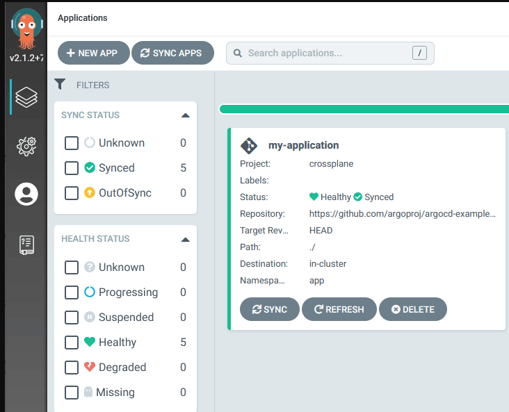
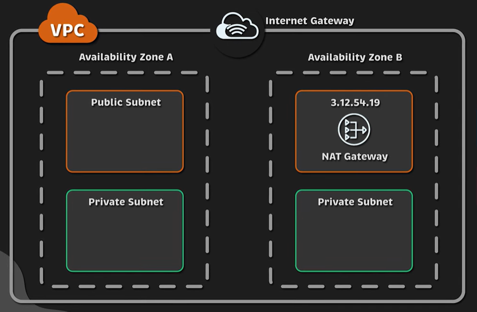
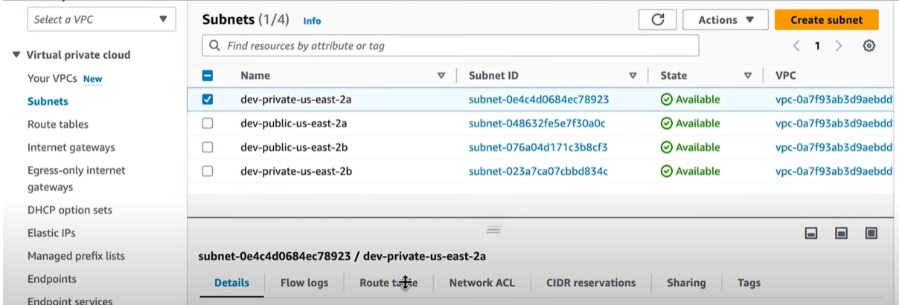
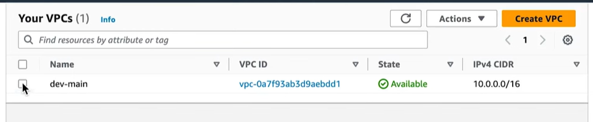
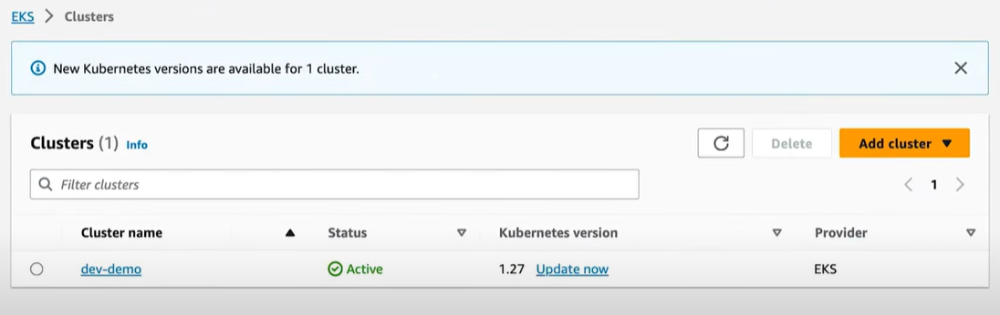

# Crossplane & ArgoCD Tutorial
I am using minikube for deploy k8s 
## Install ArgoCD
### Create a new namespace argocd and deploy ArgoCD 
```bash
kubectl create namespace argocd
kubectl apply -n argocd -f https://raw.githubusercontent.com/argoproj/argo-cd/stable/manifests/install.yaml
kubectl get all -n argocd
```

## Install Crossplane on Kubernetes

```bash
helm repo add crossplane-stable https://charts.crossplane.io/stable
helm repo update
helm search repo crossplane
helm install crossplane \
    --namespace crossplane-system \
    --create-namespace \
    --version 1.13.2 \
    crossplane-stable/crossplane

```
## Apply application crossplane for AWS resources in Argocd 
```bash
kubectl apply -f aws/argocd.yaml
```



## Create AWS VPC using Crossplane

```bash
kubectl apply -f 0-crossplane/1-provider-aws-ec2.yaml
# Check until provider status "Healthy"
kubectl get providers
kubectl apply -f 1-vpc
kubectl get VPC
kubectl get InternetGateway
kubectl get RouteTableAssociation
```



## Create EKS Cluster using Crossplane
```bash
kubectl apply -f 0-crossplane
# Check until provider status "Healthy"
kubectl get providers
kubectl apply -f 2-eks
kubectl get Cluster
kubectl get NodeGroup
aws configure --profile crossplane
aws eks update-kubeconfig --name dev-demo --region us-east-2 --profile crossplane
kubectl get nodes
```


## Apply application crossplane for AWS resources in Argocd 
```bash
kubectl apply -f azure/argocd.yaml
```